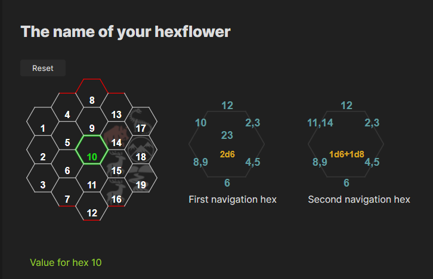
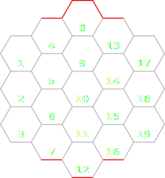

# Obsidian Hexflower Plugin



This is a widget simulating the behaviour of a Hexflower engine. A lot of information about Hexflower concept can be found at Goblin's Henchman site: <https://goblinshenchman.wordpress.com/category/hex-flower/>

## Hex positions

In the hexflower definition we do not use any of the official hexmap coordinate systems. It is not important because hex positions are used only to define their values. Thus hexes has been arbitrary numbered from 1 to 19 as it can be seen below.



## Hexflower block format

Hexflower widget is inserted as a code block with `hexflower` keyword. You can specify text value for each hex and optional icon.
It is good to specify text values for all 19 hexes but their are not mandatory.
Icons are optional as well and as you can see in the example, they can be specified for a selected hex only. One of the great sources of icons could be <https://game-icons.net/>. Plugin accepts PNG, JPG and SVG images.

<pre>

```hexflower
name: Name of your hexflower
author: original author if applicable
source: and some link to the source
current: 8
navigation:
  - name: First navigation hex
    n: 12
    ne: 2,3
    se: 4,5
    s: 6
    sw: 8,9
    nw: 10
    in: 23
    roll: 2d6
  - name: Second navigation
    n: 12
    ne: 2,3
    se: 4,5
    s: 6
    sw: 8,9
    nw: 11,14
    in: null
    roll: 1d6+1d8
values:
  1: Value at hex number 1
  2: Value at hex number 2
  3: Value at hex number 3
  4: Value at hex number 4
  ...
icons:
  1: Icon path for hex number 1 like "images/icon1.png"
  2: Icon path for hex number 2
  5: Icon path for hex number 5
  ...
```
</pre>

Alternatively, you can define the same hexflower inside a **note frontmatter section** and use it as a template. The only thing you need to do next is to define hexflower block with a `template` attribute. Please remember to include `name` attribute in your specification, because hexflower blocks are recognized and searched by their names (Thus means that names put inside a template text are replaced by the ones specified in a block).

<pre>
```hexflower
name: Hexflower from template
template: templates/weather block
```
</pre>

### Manually installing the plugin

- Copy over `main.js`, `styles.css`, `manifest.json` to your vault `VaultFolder/.obsidian/plugins/your-plugin-id/`.
